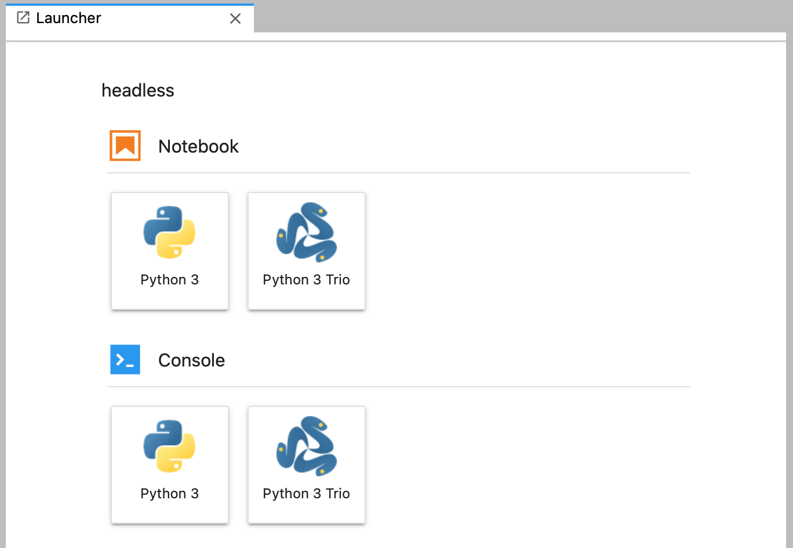

# trio-jupyter

This project lets you use [Trio](https://github.com/python-trio/trio/) inside a [Jupyter
notebook](https://jupyter.readthedocs.io/en/latest/). Under the hood, this project
installs a Jupyter kernelspec that activates Jupyter's Trio mode.


## Getting Started

Install Jupyter along with this package.

```
$ pip install jupyterlab trio-jupyter
```

> **ATTENTION** This package currently requires a private fork of ipykernel, pending
> release of [ipykernel PR #627](https://github.com/ipython/ipykernel/pull/627). In the
> meantime, install the forked ipykernel after trio-jupyter by running:
> `pip install git+https://github.com/mehaase/ipykernel`


Start Jupyter. This will start the server and open your browser to the Jupyter GUI.

```
$ jupyter-lab
```

The Jupyter launcher will display a Python Trio. Click this option to start a new notebook with Trio mode enabled.



Inside this notebook, each cell is executed as a Trio task running on a Trio loop that
is created at startup and runs until the notebook's kernel is terminated. There is also a global nursery called `GLOBAL_NURSERY` that you can use to spawn tasks that should keep running even after a cell finishes executing.

> Note: you *do not* need to run the `%autoawait trio` cell magic inside of a Trio
> notebook. In fact, trying to do so will result in an error.

For more details, see the [Trio Demo notebook](./TrioDemo.ipynb) in this repository.

## Known Issues

The implementation of Trio mode is a bit hacky, and there are some known issues with the
way this feature interacts with other features.

* The `%time` and `%%time` cell magics do not work with async code.
* Trio mode may not work in other notebook runtimes, such as Visual Studio Code.

## Publishing New Versions

To publish a new version of this project, you will need to have Twine installed. It's
recommended that you do this in a virtual env.

```
$ . venv/bin/activate
$ pip install twine
```

Update the project version in `setup.py` and create a new Git tag.

```
$ git status # make sure the working copy is clean
$ git tag X.Y.Z
$ git push origin X.Y.Z
```

Build the project:

```
$ rm -fr dist
$ python setup.py sdist
```

Upload to PyPI:

```
$ twine upload dist/*
```
